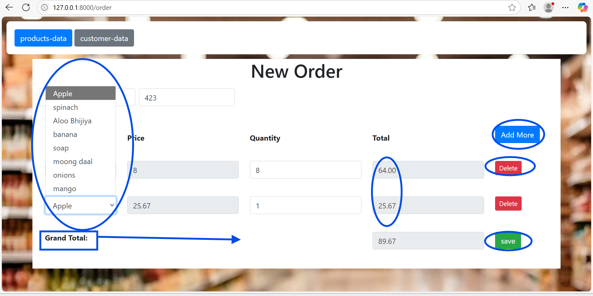
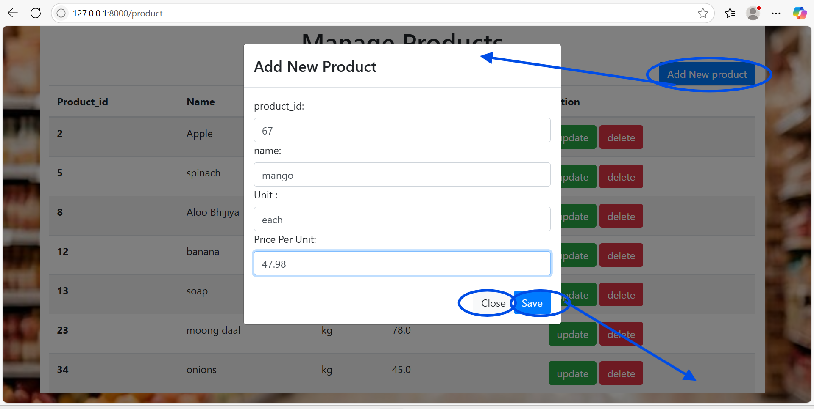

# 🛒 Grocery Store Management System

**Django-based**, inventory-driven store management web app to handle product listings, manage orders, and view customer purchases with a responsive, Bootstrap-enhanced UI.
    

## 🚀 Built With

- **Back-end**: Python 3.x, Django  
- **Front-end**: HTML5, CSS3, JavaScript, Bootstrap 4  
- **Database**: SQLite (default Django ORM)  
- **Admin panel**: Django Admin for models
  

## 🛠️ Features

 **Product Management**  
  - List all products with ID, name, unit, and price  
  - Add new products via modal form  
  - Update or delete existing products  
    
 **Order Creation**  
  - Dynamic "Add More" rows to select products, quantities, and view line totals  
  - Auto-calculated grand total based on selected items  
  - Customer name and order ID entry with form validation  
      
 **Customer Orders Overview**  
  - View all submitted orders with date, order number, customer, and total cost
      
 **Admin Dashboard**  
  - Manage products, units of measure, orders, and order details via Django Admin

    
  
