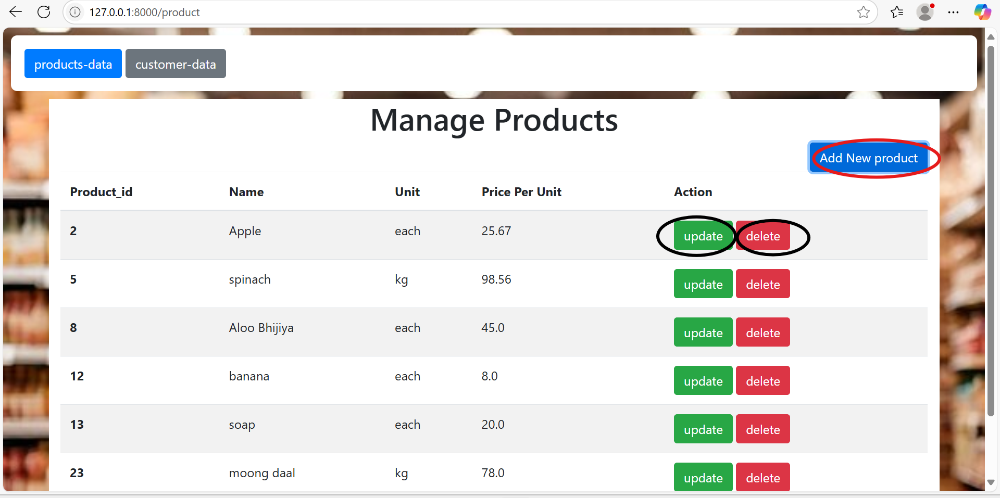

# Grocery-Store-Management-System
A Django web app to manage grocery products and take customer orders.

In this python project, we will build a grocery store management application. It will be 3 tier application,
1. Front end: UI is written in HTML/CSS/Javascript/Bootstrap
2. Backend: Python and Flask
3. Database: SQLite

## Features

- ✅ CRUD operations on products (ID, name, unit, price)
- 🛒 Create orders with multiple line items
- 🤓 Auto-calculates per-product totals and grand total
- 📜 View order history with timestamps

## Models

- UoM (unit of measure)
- Product (ID, name, UoM, price)
- Order (order number, customer name, timestamp, total)
- OrderDetail (product, quantity, unit total)
  
## 🧩 Tech Stack

- Python & Django (MVC architecture, ORM)
- SQLite (lightweight DB for quick development/testing) 
- Bootstrap framework for UI
- Vanilla JavaScript for dynamic form interactions
## Exercise 

The grocery management system that we built is functional but after we give it to users for use, we got following feedback. The exercise for you to address this feedback and implement these features in the application,
1. **Products Module**: In products page that lists current products, add and update button next to delete button that allows to edit current product
   
3. **Products Module**: Implement a new form that allows you to add new UOM in the application. For example you want to add **Cubic Meter** as a new UOM as the grocery store decided to start selling **wood** as well. This requies changing backend (python server) and front end (UI) both.
4. **Orders Module**:  When you manually change total price of an item it  change the grand total. 
5. **Orders Module**: In the grid where orders are listed, add a view button in the last column. On clicking this button it should show you order details where individual items in that order are listed along with their price/quantity etc.

  
